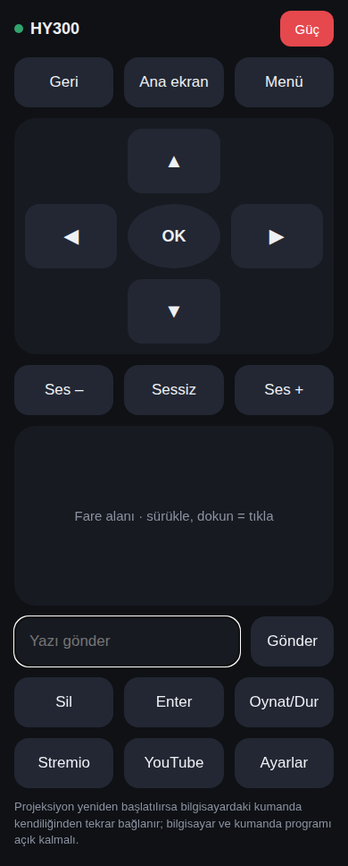

# HY300 Safari Kumandası

Bilgisayarda çalışan küçük bir program. Projeksiyona Wi-Fi üzerinden **ADB** ile
bağlanır ve telefondaki Safari'ye kumanda sayfası sunar. Projeksiyon yeniden
başlatılırsa program kendiliğinden tekrar bağlanır.

```
iPhone Safari  --Wi-Fi-->  bilgisayar (kumanda.py)  --ADB-->  HY300
```



## 1. Bilgisayarda bir kez

- **Python 3**: https://www.python.org (Windows'ta kurarken "Add to PATH" işaretleyin)
- **adb (Android platform-tools)**:
  - Mac: `brew install android-platform-tools`
  - Windows: https://developer.android.com/tools/releases/platform-tools adresinden
    indirip klasörü PATH'e ekleyin (veya `adb.exe`'yi bu klasöre kopyalayın)

## 2. Projeksiyonda bir kez

1. Ayarlar → Sistem/Hakkında → **Derleme numarası**'na 7 kez basın (Geliştirici seçenekleri açılır).
2. Geliştirici seçenekleri → **USB hata ayıklama** ve varsa **Ağ/Kablosuz ADB** açın.
3. Projeksiyonun IP adresini not edin (Ayarlar → Ağ).
4. Program ilk bağlandığında projeksiyonda **"USB hata ayıklamaya izin verilsin mi?"**
   penceresi çıkar → **Her zaman izin ver** işaretleyip onaylayın.

## 3. Çalıştırma

```
python3 kumanda.py 192.168.31.xx     # projeksiyonun IP'si
```

IP verilmezse program ağı tarayıp projeksiyonu kendi bulur; bulunan IP `ayar.json`
dosyasına kaydedilir, sonraki seferlerde sadece `python3 kumanda.py` yeterli.
Windows'ta `baslat.bat`, Mac'te `baslat.command` dosyasına çift tıklamak da olur.

Program ekrana açılacak adresi yazar (ör. `http://192.168.31.185`). Telefonda Safari'den
açın; Paylaş → **Ana Ekrana Ekle** ile uygulama gibi kullanabilirsiniz.

Port 80 için yetki yoksa program 8080'e geçer; o zaman adres `http://<ip>:8080` olur.

## Tuşlar

| Sayfadaki tuş | Projeksiyonda |
| --- | --- |
| Yön tuşları, OK, Geri, Ana ekran, Menü | Android tuşları (basılı tutunca tekrar) |
| Ses –/+, Sessiz, Oynat/Dur, Güç | Ses ve medya tuşları |
| Fare alanı | Alan projeksiyon ekranına birebir karşılık gelir: dokun = o noktaya tıkla, sürükle = kaydır |
| Yazı gönder | Odaktaki metin kutusuna yazar (ç, ğ, ı, ö, ş, ü → c, g, i, o, s, u) |
| Stremio / YouTube / Ayarlar | Uygulamayı açar (YouTube için YouTube TV veya SmartTube aranır) |

## Sorun giderme

- **Kırmızı "bağlanılıyor" uyarısı:** Projeksiyon açık mı, aynı ağda mı? IP değiştiyse
  `ayar.json`'u silin ya da yeni IP ile başlatın.
- **"İzin ver" uyarısı:** Projeksiyondaki ADB onay penceresini kabul edin.
- **Sayfa açılmıyor:** Bilgisayardaki program açık mı, telefon aynı Wi-Fi'de mi,
  güvenlik duvarı Python'a izin veriyor mu?
- Projeksiyon kapatıldıktan sonra ağ üzerinden açılamaz (Güç tuşu sadece kapatır/uyutur).
