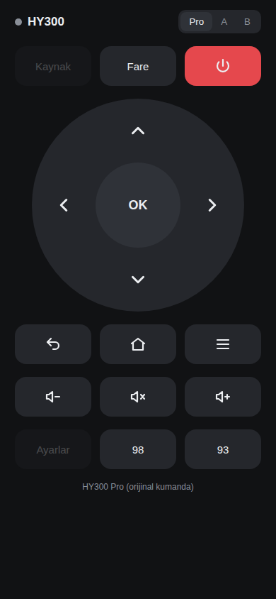

# HY300 Safari Kumandası

iPhone'da IR verici yok. Bu yüzden Safari, küçük bir ESP8266/ESP32 kartına Wi-Fi üzerinden
istek gönderir; kart da bu istekleri IR LED ile projeksiyona NEC kodu olarak iletir.

```
iPhone Safari  --Wi-Fi-->  ESP8266/ESP32 + IR LED  --IR-->  HY300
```



## Gerekenler

- ESP8266 (Wemos D1 mini, NodeMCU) veya ESP32 kart
- 940 nm IR LED, 2N2222 (veya benzeri NPN) transistör, ~100 Ω ve ~1 kΩ direnç

## Bağlantı

```
GPIO4 (D1 mini'de D2) --1kΩ-- transistör Base
3V3/5V --100Ω-- IR LED (+)   IR LED (-) -- transistör Collector
GND -- transistör Emitter
```

Kısa mesafe deneme için LED doğrudan GPIO4 → LED → GND şeklinde de bağlanabilir, ama
menzil birkaç on santimetreyle sınırlı kalır. LED'i projeksiyonun önüne doğru çevirin.

## Kurulum

1. Arduino IDE → Kütüphane Yöneticisi → **IRremoteESP8266** kurun.
2. `safari-kumanda.ino` dosyasını açın. İsterseniz `WIFI_SSID` / `WIFI_PASS` alanlarına
   ev Wi-Fi'nizi yazın.
3. Kartı seçip yükleyin.

## Kullanım

- **Ev Wi-Fi'si girildiyse:** iPhone aynı ağdayken Safari'de `http://hy300.local` açın
  (olmazsa Seri Monitör'de yazan IP adresini kullanın).
- **Girilmediyse / bağlanamazsa:** iPhone'dan `HY300-Kumanda` ağına bağlanın
  (şifre `hy300kumanda`), Safari'de `http://192.168.4.1` açın.
- Paylaş → **Ana Ekrana Ekle** ile tam ekran uygulama gibi kullanılabilir.
- Sağ üstteki **Pro / A / B** seçimi repodaki kod setlerini değiştirir:
  - **Pro** → `hy300-kumanda-C.ir` (orijinal kumandadan kaydedilen, varsayılan)
  - **A** → `hy300-kumanda-A.ir` (adres 1)
  - **B** → `hy300-kumanda-B.ir` (adres 0)

  Projeksiyon tepki vermezse diğer seti deneyin; seçim tarayıcıda hatırlanır.
- Yön ve ses tuşları basılı tutulunca tekrar eder. Sol üstteki nokta yeşil yanarsa
  komut karta ulaşmıştır.

## Arayüzü düzenlemek

Arayüz `index.html` dosyasındadır. Değiştirdikten sonra `python3 make_page.py`
çalıştırıp `page.h`'yi yeniden üretin ve kartı tekrar yükleyin.
